# Enterprise-Grade Verifiable RAG Application
### A production-ready, locally-hosted RAG system with a multi-stage architecture for maximum accuracy and trust.

[](https://www.python.org/downloads/)
[](https://opensource.org/licenses/MIT)

This repository provides an enterprise-grade, **verifiable** Retrieval-Augmented Generation (RAG) system engineered to deliver high-precision, factually grounded answers from private documents. It moves beyond standard RAG prototypes by implementing a multi-stage, self-correcting architecture that builds unbreakable trust and ensures mission-critical reliability.

The entire system runs on *local infrastructure* using **Ollama** and **AnythingLLM**, guaranteeing 100% data privacy and security.

## ✨ Core Features & Technical Highlights

This system is built with production-readiness in mind, incorporating numerous advanced techniques:

*   **Hybrid VLM+OCR Ingestion:** An intelligent document parsing pipeline that uses a visual heuristic to decide between high-speed OCR for simple text and a Vision Language Model (VLM) for accurately extracting and structuring complex visual layouts like tables, charts, and multi-column text.
*   **Configurable Ingestion Profiles:** Pre-tuned processing profiles allow users to optimize ingestion for different document types, controlling parameters like sentences per chunk, sentence overlap, DPI, and VLM usage.
*   **Advanced Multi-Step Retrieval:**
    *   **Hypothetical Document Embeddings (HyDE):** An optional "Conceptual Search" mode that generates an ideal answer *before* retrieval, improving results for abstract queries.
    *   **Multi-Query Expansion:** Automatically rewrites the user's query into three distinct variants to broaden the search and maximize document recall.
    *   **Adaptive Cross-Encoder Reranking:** A sophisticated final pass using a CrossEncoder model to re-score and rank retrieved chunks for maximum relevance.
*   **Chain-of-Verification (CoV):** A final, critical validation step where an LLM fact-checks the generated answer against the source context, virtually eliminating hallucinations and providing a clear validation status.
*   **Robust & Isolated Workspaces:** Each processing session generates a unique, timestamped workspace in AnythingLLM, ensuring zero data contamination between different knowledge bases.
*   **Stable, Asynchronous Uploads:** The document upload process is engineered for stability, using an `asyncio.Semaphore` to prevent server overload by processing uploads sequentially.
*   **Expert Prompt Engineering:** The system's behavior is guided by a suite of specialized prompts, including a restrictive system prompt for generation and a powerful vision restructuring prompt for the VLM.

---

## ⚙️ Architectural Workflow

The system is logically divided into two distinct phases: a one-time **Ingestion Pipeline** for knowledge base creation, and a real-time **Query Pipeline** for delivering verified answers.

### Phase 1: Ingestion & Knowledge Base Creation

This automated pipeline converts raw, unstructured documents into a highly optimized and searchable vector knowledge base.

```mermaid
graph TD

    %% --- Style Definitions ---
    classDef header fill:none,color:#000,stroke:none,font-weight:bold,font-size:24px
    classDef step fill:#f3e5f5,color:#333,stroke:#ab47bc,stroke-width:1px
    classDef diamond fill:#e1bee7,color:#333,stroke:#8e24aa,stroke-width:1px
    classDef start fill:#2196f3,color:#fff,stroke:#1976d2,stroke-width:2px
    classDef kb fill:#4caf50,color:#fff,stroke:#388e3c,stroke-width:2px

    %% --- Chart Definition ---
    UserInput([📄 User Input:<br>Documents & Processing Profile]):::start

    subgraph subgraph1 [ ]
        style subgraph1 fill:#fef9e7,stroke:#f1c40f
        S1_Title[Step 1: Secure Ingestion]:::header
        S1_Action[🔐 Create Isolated<br>Timestamped Workspace]:::step
    end

    subgraph subgraph2 [ ]
        style subgraph2 fill:#fef9e7,stroke:#f1c40f
        S2_Title[Step 2: Intelligent Hybrid Extraction]:::header
        S2_Decision{🧠 Intelligent Page Analysis}:::diamond
        S2_PathA[⚡ Path A: Simple Layout<br>High-Speed OCR Extraction]:::step
        S2_PathB[👁️ Path B: Complex Layout<br>VLM for Tables, Charts, etc.]:::step
    end

    subgraph subgraph3 [ ]
        style subgraph3 fill:#fef9e7,stroke:#f1c40f
        S3_Title[Step 3: Consolidation & Vectorization]:::header
        S3_Action1[📝 Consolidate and Structure Text]:::step
        S3_Action2[✂️ Advanced Semantic Chunking]:::step
        S3_Action3[📤 Stable Sequential Uploads]:::step
        S3_Action4[🧠 Vectorization and Indexing]:::step
    end

    KnowledgeBase([✅ Query-Ready Knowledge Base]):::kb

    %% --- Explicit Connections ---
    UserInput --> S1_Title
    S1_Title --> S1_Action
    S1_Action --> S2_Title

    S2_Title --> S2_Decision
    S2_Decision --> S2_PathA
    S2_Decision --> S2_PathB

    S2_PathA --> S3_Title
    S2_PathB --> S3_Title

    S3_Title --> S3_Action1
    S3_Action1 --> S3_Action2
    S3_Action2 --> S3_Action3
    S3_Action3 --> S3_Action4
    S3_Action4 --> KnowledgeBase
```



1.  **Initiation:** The user selects documents and a pre-configured Processing Profile via the Gradio UI.
2.  **Workspace Isolation:** A new, secure workspace with a unique timestamped name is instantiated in AnythingLLM.
3.  **Intelligent Page Analysis:** The system iterates through each page of the source PDF, classifying each page as "simple" (text-only) or "complex."
4.  **Hybrid Content Extraction:** For simple pages, fast, standard OCR is used. For complex pages, a VLM analyzes the visual layout to correctly transcribe text from charts, format tables into Markdown, and preserve multi-column reading order.
5.  **Semantic Chunking:** The clean, structured text from each page is split into small, semantically complete chunks.
6.  **Robust Upload:** Each text chunk is uploaded to AnythingLLM sequentially to ensure stability.
7.  **Vectorization & Indexing:** AnythingLLM's embedding model converts each text chunk into a numerical vector and stores it, making the knowledge base ready for querying.

### Phase 2: Query, Verification & Response

This multi-agent pipeline processes a user's question to deliver a factually verified, fully cited answer.

```mermaid
graph TD

    %% --- Style Definitions ---
    classDef header fill:none,color:#000,stroke:none,font-weight:bold,font-size:24px
    classDef step fill:#e3f2fd,color:#333,stroke:#42a5f5,stroke-width:1px
    classDef decision fill:#e1f5fe,color:#333,stroke:#03a9f4,stroke-width:1px
    classDef input fill:#0288d1,color:#fff,stroke:#01579b,stroke-width:2px
    classDef output fill:#4caf50,color:#fff,stroke:#388e3c,stroke-width:2px
    classDef cov fill:#fffde7,color:#000,stroke:#fbc02d,stroke-width:2px

    %% --- Chart Definition ---
    UserInput([👤 User Asks Question]):::input

    subgraph subgraph1 [ ]
        style subgraph1 fill:#fef9e7,stroke:#f1c40f
        S1_Title[Step 1: Query Understanding]:::header
        S1_Decision{Query Enhancement}:::decision
        S1_PathA[💡 HyDE<br>Optional Conceptual Search]:::step
        S1_PathB[🔍 Multi-Query Expansion<br>Broaden Search Recall]:::step
    end

    subgraph subgraph2 [ ]
        style subgraph2 fill:#fef9e7,stroke:#f1c40f
        S2_Title[Step 2: Retrieval & Reranking]:::header
        S2_Action1[📚 Multi-Vector Retrieval]:::step
        S2_Action2[🎯 Cross-Encoder Reranking]:::step
        S2_Action3[📋 Assemble Final Context]:::step
    end

    subgraph subgraph3 [ ]
        style subgraph3 fill:#fef9e7,stroke:#f1c40f
        S3_Title[Step 3: Synthesis & Verification]:::header
        S3_Action1[🧠 Synthesize Answer]:::step
        S3_CoV[🛡️ Chain-of-Verification<br>Fact-Check Answer Against Sources]:::cov
        S3_Decision{Is Every Claim Supported?}:::decision
        S3_PathA[✅ Validated Answer<br>Append Citations]:::step
        S3_PathB[❌ Invalidated Answer<br>Flag Hallucination]:::step
    end

    FinalResponse([Final Verified Response]):::output

    %% --- Explicit Connections ---
    UserInput --> S1_Title
    S1_Title --> S1_Decision
    S1_Decision -- "Conceptual" --> S1_PathA
    S1_Decision -- "Standard" --> S1_PathB

    S1_PathA --> S2_Title
    S1_PathB --> S2_Title
    S2_Title --> S2_Action1
    S2_Action1 --> S2_Action2
    S2_Action2 --> S2_Action3

    S2_Action3 --> S3_Title
    S3_Title --> S3_Action1
    S3_Action1 --> S3_CoV
    S3_CoV --> S3_Decision
    S3_Decision -- "Yes" --> S3_PathA
    S3_Decision -- "No" --> S3_PathB
    S3_PathA --> FinalResponse
    S3_PathB --> FinalResponse```

1.  **Query Input:** The user submits a question.
2.  **Query Enhancement:** This includes optional HyDE and multi-query expansion.
3.  **Multi-Vector Retrieval:** All query variants are sent to the AnythingLLM workspace to retrieve a wide "candidate pool" of relevant document chunks.
4.  **Precision Reranking:** The initial candidate pool is passed to a CrossEncoder that re-scores each chunk against the original user query for contextual relevance.
5.  **Contextual Synthesis:** The top-ranked chunks are used to assemble a rich context block to synthesize an answer.
6.  **Chain-of-Verification:** The generated answer and the source context are sent to a validation model that is guided by a rigorous prompt to break down the answer into individual claims and confirm that each one is factually supported by the context.
7.  **Verified Response Delivery:** The final answer is formatted, prepended with a validation marker (✅ or ❌), and appended with cited source snippets.

---

## 🚀 Setup and Installation

### Prerequisites

*   **Python 3.8+** and `pip`
*   **Ollama:** Installed and running. [Download here](https://ollama.com/).
*   **AnythingLLM:** Docker is the recommended setup. [Official Guide](https://docs.useanything.com/getting-started/docker-installation).
*   **Git**

### 1. Clone the Repository

```bash
git clone https://github.com/alanto0923/production-rag-gradio.git
cd production-rag-gradio
```

### 2. Create Virtual Environment & Install Dependencies

It is highly recommended to create a `requirements.txt` file with the following content:

```
gradio
httpx
PyMuPDF
sentence-transformers
nltk
torch
torchvision
torchaudio
```

Then, run the installation:

```bash
# Create and activate a virtual environment
python -m venv venv
source venv/bin/activate # On Windows: venv\Scripts\activate

# Install from requirements.txt
pip install -r requirements.txt
```

The script will also attempt to auto-download necessary NLTK data on first run.

### 3. Download Local LLM Models

Ensure your Ollama service is running, then pull the default models:

```bash
# Vision model for document preprocessing
ollama pull qwen2.5vl:72b

# For HyDE, generation, and validation (or your preferred model)
ollama pull gpt-oss:latest
```

### 4. Configure AnythingLLM API Key

1.  Start your AnythingLLM instance.
2.  Navigate to **Settings** -> **API Keys** and generate a new key.
3.  Set this key as an environment variable for security.

**Linux/macOS:**

```bash
export ANYTHINGLLM_API_KEY="your-api-key-here"
```

**Windows (PowerShell):**

```powershell
$env:ANYTHINGLLM_API_KEY="your-api-key-here"
```

---

## 📖 How to Use

**1. Add Your Documents:** Place your PDF, TXT, or MD files into the `documents` folder.

**2. Run the Application:**

```bash
python your_script_name.py
```

**3. Open the Web UI:** Access the local URL provided in your terminal (e.g., `http://127.0.0.1:7860`).

### User Workflow

1.  **Select Processing Profile:** Choose a profile optimized for your document type.
2.  **Select Documents:** Use the radio buttons to select all documents, a folder, or specific files.
3.  **Click "Create Workspace and Process Document(s)"**: Monitor the live logs as the system ingests your data. The chat interface will appear upon completion.
4.  **Ask Questions:** Type your query into the chat. For deeper, more abstract questions, enable the **"Conceptual Search"** checkbox to activate the HyDE strategy.
5.  **Review Verified Answers:** Analyze the response, its validation emoji (✅/❌), and the supporting source snippets provided.
6.  **Reset:** To start over with new documents, click **"Process Other Documents"**. 
